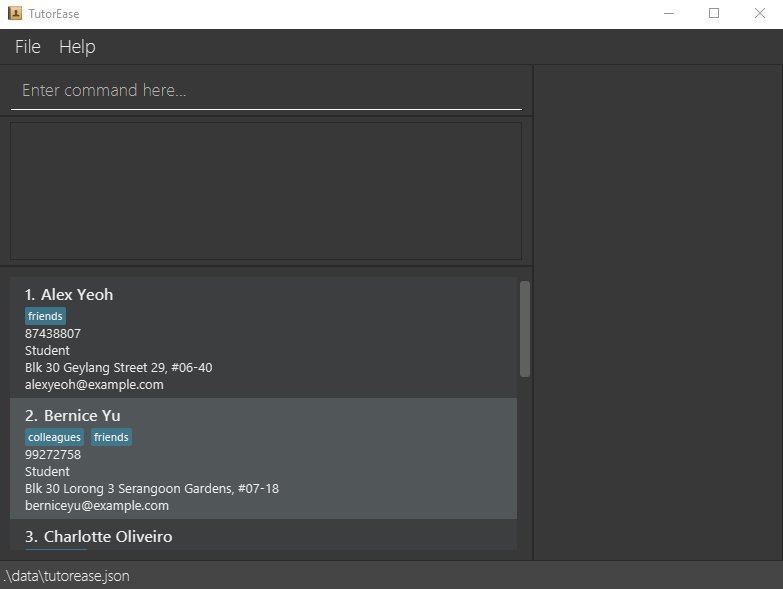
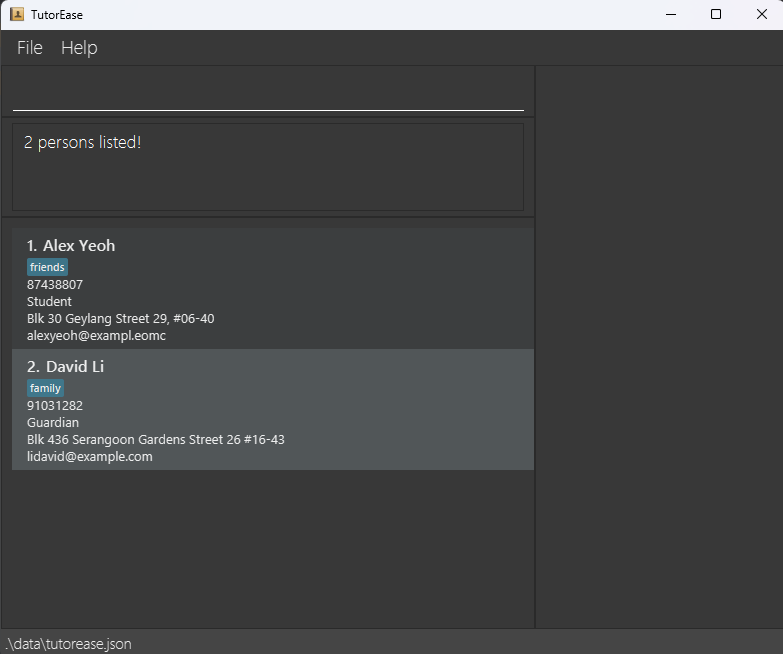
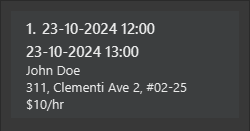
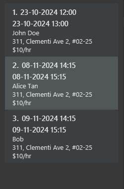
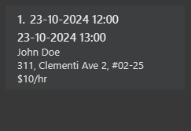

# TutorEase User Guide

TutorEase is a **desktop app for freelance pre-university home tutors to manage student and guardian contacts, as well as lesson schedules, optimized for use via a Command Line Interface** (CLI) while
still having the benefits of a Graphical User Interface (GUI). If you can type fast, TutorEase can get your contact and lesson management
tasks done faster than traditional GUI apps.

<!-- * Table of Contents -->
<page-nav-print />

--------------------------------------------------------------------------------------------------------------------

## Quick start

1. Ensure you have Java `17` or above installed in your Computer.

1. Download the latest `tutorease.jar` file from [here](https://github.com/AY2425S1-CS2103-F11-2/tp/releases).

1. Copy the file to the folder you want to use as the _home folder_ for TutorEase.

1. Open a command terminal, `cd` into the folder you put the jar file in, and use the `java -jar tutorease.jar`
   command to run the application. A GUI similar to the below should appear in a few seconds. Note how the app contains some sample data. 
   

1. Type the command in the [command box](#UI-Layout) and press Enter to execute it. e.g. typing **`help`** and pressing Enter will
   open the help window. 
   Some example commands you can try:

    * `contact list` : Lists all contacts.

    * `contact add n/John Doe p/98765432 e/johnd@example.com a/311, Clementi Ave 2, #02-25 r/Student t/friends t/owesMoney`:
      Adds a contact named `John Doe` to the Address Book.

    * `contact delete 3` : Deletes the 3rd contact shown in the current list.

    * `clear` : Deletes all contacts.

    * `exit` : Exits the app.

1. Refer to the [Features](#features) below for details of each command.

## UI Layout
Here are the different components of the TutorEase UI:

1. **Command Box**: The command box is where you can type your commands to interact with TutorEase.
2. **Command Output Display**: The command output display is where the output and result of the commands you have entered will be displayed.
3. **Contact List**: The contact list displays all the contacts that you have added to TutorEase.
4. **Lesson List**: The lesson list displays all the lessons that you have added to TutorEase.

--------------------------------------------------------------------------------------------------------------------

## Features

<box type="info" seamless>

**Notes about the command format:** 

* Words in `UPPER_CASE` are the parameters to be supplied by the user. 
  e.g. in `contact add n/NAME`, `NAME` is a parameter which can be used as `contact add n/John Doe`.

* Items in square brackets are optional. 
  e.g `n/NAME [t/TAG]` can be used as `n/John Doe t/friend` or as `n/John Doe`.

* Items with `…`​ after them can be used multiple times including zero times. 
  e.g. `[t/TAG]…​` can be used as ` ` (i.e. 0 times), `t/friend`, `t/friend t/family` etc.

* Parameters can be in any order. 
  e.g. if the command specifies `n/NAME p/PHONE_NUMBER`, `p/PHONE_NUMBER n/NAME` is also acceptable.

* Extraneous parameters for commands that do not take in parameters (such as `help`, `list`, `exit` and `clear`) will be
  ignored. 
  e.g. if the command specifies `help 123`, it will be interpreted as `help`.

* Prefixes is not case-sensitive.  
  e.g. if command specifies `n/NAME p/PHONE_NUMBER`, `N/NAME p/PHONE_NUMBER` is also acceptable.

* Commands is not case-sensitive.  
  e.g. if command is `contact add`, `CONTact ADd` is also acceptable.

* If you are using a PDF version of this document, be careful when copying and pasting commands that span multiple lines
  as space characters surrounding line-breaks may be omitted when copied over to the application.
  </box>

### Viewing help : `help`

Shows pop-up window with a message explaining how to access the help page.

Format: `help`

### Adding a person: `contact add`

Adds a person to the TutorEase Address Book.

Format: `contact add n/NAME p/PHONE_NUMBER e/EMAIL a/ADDRESS r/ROLE [t/TAG]…​`

Remarks:
* Add a contact with the specified details.

Field          | Optional/Compulsory | Prefix | Remarks
---------------|---------------------|--------|-----------------------------------------
`NAME`         | Compulsory          | n/     | 1. `NAME` should only contain alphanumeric characters, spaces and round brackets.   2. Duplicated names is strictly not allowed. Please include a unique identifier like "Ryan Tan (Sec 1)".   3. `NAME` with symbols like "s/o", "d/o", "D'Cruz", "Lim, Jacus", and etc will not be allowed. However, so and do are accepted, please write without these symbols.   4. `NAME` that are duplicated will be prompted to add a unique identifier.  5. `NAME` with additional white spaces in between terms will be taken as it is.
`PHONE_NUMBER` | Compulsory          | p/     | 1. `PHONE_NUMBER` can must be a non-negative integers.   2. `PHONE_NUMBER` can start with any number.   3. `PHONE_NUMBER` must have a length of at least 3.   4. `PHONE_NUMBER` does not have a limit on length.   5. Duplicated phone numbers is strictly not allowed.   6. Do not include "+" as we only supports local contact numbers only.
`EMAIL`        | Compulsory          | e/     | `EMAIL` should be of format `local-part@domain` with the following constraints  1.`local-part` should only contain alphanumeric characters and these special characters, excluding the parentheses, (+-._).  2. `local-part` may not start or end with any special characters.  3. `local-part`'s special characters should not be adjacent to one another.  4. `domain` is made up of domain labels separated by periods.  5. After every period, ensure that each domain label has at least 2 consecutive alphanumeric characters.   6. `domain` must:  6a. end with a `domain` label at least 2 characters long.   6b. have each `domain` label start and end with alphanumeric characters.   6c. have each `domain` label consist of alphanumeric characters, separated only by hyphens, if any.
`ADDRESS`      | Compulsory          | a/     | 1. `ADDRESS` can be in any form with any amount of characters.   2. `ADDRESS` with non-alphanumeric characters are accepted like "😁" too.
`ROLE`         | Compulsory          | r/     | 1. `ROLE` can only be Student or Guardian.   2. `ROLE` need is case-insensitive. e.g. `ROLE` can be `stUDent` or `GuaRDIAN`.
`TAGS`         | Optional            | t/     | 1. `TAGS` have no limits on quantity.   2. `TAGS` can only have alphanumeric characters with no spacing.
> **Note 1:** Lessons can only be added to contacts with the role of student. Therefore, if you want to add a lesson to a contact, you must first add the contact with the role of student.
>   **Note 2:** `NAME` and `EMAIL` are case-insensitive.

Examples:

* `contact add n/Norbeast p/987654322131 e/norbeast@example.com a/John street, block 123, #01-01 r/Student`

* `contact add n/Betsy Crowe t/friend e/betsycrowe@example.com r/Guardian a/Newgate Prison p/1234567 t/criminal`

### Listing all persons : `contact list`

Shows a list of all persons in the address book.

Format: `contact list`

### Editing a person : `contact edit`

Edits an existing person in the address book.

Format: `contact edit INDEX [n/NAME] [p/PHONE] [e/EMAIL] [a/ADDRESS] [t/TAG]…​`

Remarks:

* Edits the person at the specified `INDEX`. The index refers to the index number shown in the displayed person list.
  The index **must be a positive integer** 1, 2, 3, …​
* `INDEX` must be within the range of the displayed list.
* At least one of the optional fields must be provided.
* Existing values will be updated to the input values.
* When editing tags, the existing tags of the person will be removed i.e adding of tags is not cumulative.
* You can remove all the person’s tags by typing `t/` without specifying any tags after it.
* `ROLE` is not editable!
* All constraints from `contact add` command still stands with `contact edit` command. 
* In particular, we cannot edit contact to have same name, phone number or email as existing contacts.

Examples:

* `contact edit 1 p/91234567 e/johndoe@example.com` Edits the phone number and email address of the 1st person to
  be `91234567` and `johndoe@example.com` respectively.
* `contact edit 2 n/Betsy Crower t/` Edits the name of the 2nd person to be `Betsy Crower` and clears all existing tags.

### Locating persons by name: `contact find`

Finds persons whose names contain any of the given keywords.

Format: `contact find KEYWORD [MORE_KEYWORDS]`

Remarks:

* The search is case-insensitive. e.g. `hans` will match `Hans`.
* The order of the keywords does not matter. e.g. `Hans Bo` will match `Bo Hans`.
* Only the name is searched.
* Only full words will be matched e.g. `Han` will not match `Hans`.
* Persons matching at least one keyword will be returned (i.e. `OR` search).
  e.g. `Hans Bo` will return `Hans Gruber`, `Bo Yang`.

Examples:

* `contact find John` returns `john` and `John Doe`.
* `contact find alex david` returns `Alex Yeoh`, `David Li.` 
  

### Deleting a person : `contact delete`

Deletes the specified person from the address book.

Format: `contact delete INDEX`

Remarks:

* Deletes the person at the specified `INDEX`.
* The index refers to the index number shown in the displayed person list.
* The index **must be a positive integer** 1, 2, 3, …​
* `INDEX` must be within the range of the displayed list.

Examples:

* `contact list` followed by `contact delete 2` deletes the 2nd person in the address book.
* `contact find Betsy` followed by `contact delete 1` deletes the 1st person in the results of the `find` command.

### Adding a lesson : `lesson add`

Adds a lesson tied to a student with start and end date time.

Format: `lesson add sid/STUDENTID f/PRICEPERHOUR d/STARTDATETIME h/DURATION`

Field          | Optional/Compulsory | Prefix | Remarks
---------------|---------------------|--------|-----------------------------------------
`STUDENTID`    | Compulsory          | sid/   | 1. Add a lesson with the student at specified `STUDENTID`.  2. `STUDENTID` refers to the index number shown in the displayed contact list.  3. The student ID **must be a positive integer** 1, 2, 3, …​, within the range of the number of students in the address book. 
`PRICEPERHOUR` | Compulsory          | f/     | 1. The `PRICEPERHOUR` refers to the price of the lesson per hour.  2. The `PRICEPERHOUR` **must be a non-negative integer**. 
`STARTDATETIME`| Compulsory          | d/     | 1. The lesson starts at the specified `STARTDATETIME` in the format `dd-MM-yyyy HH:mm`.  2. The date time format is not fixed to any timezones.  3. Past lessons can be added for tracking purposes. 
`DURATION`     | Compulsory          | h/     | 1. The duration **must be a decimal number or an integer** in multiples of 0.5.  2. The duration have to be more than 0 and be at most 24.  3. The duration of the lesson is specified by the `DURATION` in hours. 

> **Note:**
> 1. Lessons can only be added to contacts with the role of student. Therefore, if you want to add a lesson to a contact, you must first add the contact with the role of student.
> 2. The student location will automatically be set to the address of the student.
> 3. Addresses that are too long will be displayed fully in multiple lines in the lesson panel as tutors would need the full location of the student.
> 4. The lesson added will be in sorted order of the start date time.
> 5. The name of student for the lesson is linked to the student contact.
> 6. The end date time of the lesson is automatically calculated based on the start date time and duration of the lesson.

Examples: `lesson add sid/1 f/10 d/23-10-2024 12:00 h/1`

Adds a lesson with the student at index 1, price per hour of 10, starting on 23rd October 2024 at 12:00 and lasting 1 hour to the lesson panel.

### Listing all lessons : `lesson list`

Shows a list of all lessons in the schedule.

Format: `lesson list`

### Deleting a lesson : `lesson delete`

Deletes the lesson at the specified index from the lesson schedule. Deleting a student will also delete all lessons associated with the student.

Format: `lesson delete INDEX`

Remarks:

* Deletes the lesson at the specified `INDEX`.
* The index refers to the index number shown in the displayed lesson schedule.
* The index **must be a positive integer** 1, 2, 3, …​.
* `INDEX` must be within the range of the displayed list.
* If a `lesson find` operation was done prior to this, `INDEX` needs to be in the new range as a result of 
  find.

Examples:

* `lesson delete 2` deletes the 2nd lesson in the lessons schedule.

### Finding lessons : `lesson find`

Find lessons with students whose names contain any of the specified keywords.

Format: `lesson find KEYWORD [MORE_KEYWORDS]`

Remarks:

* The search is case-insensitive. e.g. `hans` will match `Hans`.
* The order of the keywords does not matter. e.g. `Hans Bo` will match `Bo Hans`.
* Only the name is searched.
* Only full words will be matched e.g. `Han` will not match `Hans`.
* Lessons with students whose names match at least one of the specified keywords will be returned (i.e.,
  an OR search).
  e.g. `Hans Bo` will return lessons with `Hans Gruber` if any and `Bo Yang` if any.

Examples:

* View all lessons using `lesson list` command. 
  
* `lesson find John` returns `John Doe`'s lessons. 
  
* `lesson find John Alice` returns lessons with `John Doe` if any and `Alice Tan` if any. 
  

### Clearing all entries : `clear`

Clears all entries from TutorEase which includes all contacts and lessons.

Format: `clear`

### Exiting the program : `exit`

Exits the program.

Format: `exit`

### Saving the data

TutorEase data are saved in the hard disk automatically after any command that changes the data. There is no need to
save manually.

### Editing the data file

TutorEase data are saved automatically as a JSON file `[JAR file location]/data/tutorease.json` and `[JAR file location]/data/lessonschedule.json`. Advanced users are
welcome to update data directly by editing that data file.

<box type="warning" seamless>

**Caution:**
If your changes to the data file makes its format invalid, TutorEase will discard all data and start with an empty
data file at the next run. Hence, it is recommended to take a backup of the file before editing it. 
Furthermore, certain edits can cause TutorEase to behave in unexpected ways (e.g., if a value entered is outside
the acceptable range). Therefore, edit the data file only if you are confident that you can update it correctly.
</box>

### Archiving data files `[coming in v2.0]`

_Details coming soon ..._
--------------------------------------------------------------------------------------------------------------------

## Future Enhancements

#### 1. **Unique Attributes and Relationship Modeling for Students and Guardians**
Recognizing the importance of capturing more details about different types of contacts, we plan to incorporate additional attributes for students, such as grade levels, subjects and exam dates. 
To support clear organization, we’ll also implement a tagging system that links each student to their respective guardian, making it easier to manage relationships and access relevant information at a glance.

#### 2. **Find Students by Subjects or Grade Levels**
To support easy organization and access, we’re introducing a categorization system that allows you to sort students by their enrolled subjects and grade levels. 
This enhancement will help you quickly filter students and manage their academic needs more efficiently.

#### 3. **Exam Date Management**
We understand the importance of staying prepared for exams, so we’re adding a feature to track upcoming exam dates for each student. 
With this addition, guardians and you will receive timely reminders or notifications, ensuring students are ready and supported in their preparation.

#### 4. **Fee and Payment Tracking**
Keeping track of fees is essential in the business aspect, so we plan to implement a detailed payment tracking system. 
This feature will log due dates, total payment amounts, and any outstanding fees for each student, while also linking this information to the responsible guardian.

#### 5. **Recurring Lessons**
Recognizing that most tuition lessons occur weekly at the same time, we plan to introduce a feature that allows you to set lessons as either one-time sessions or recurring events. 
You will be able to stipulate the frequency of recurrence, whether weekly, bi-weekly, or custom intervals, to fit their specific scheduling needs.

#### 6. **Overlapping Lesson Time Handling**
We recognize the need for clarity around overlapping lesson scheduling. Options for managing overlaps will include:

* Allowing overlapping sessions for group lessons or pair lessons.
* Enabling you to customize settings for overlap permissions based on the type of lesson.

#### 7. **Enhanced Name Field Support**
To accommodate contacts with names that contain special characters, such as commas, we plan to update the application to allow names with these characters.
In the future, the system will support a wider variety of name formats, making it more inclusive and user-friendly.

Additionally, if extra whitespace is accidentally added between names (e.g., double space between first and last name), the system will show a warning to alert you of potential duplicate entries due to spacing inconsistencies.

#### 8. **Past Lesson Management**
To enhance lesson organization, we plan to introduce features that clearly distinguish past lessons. This will include options to automatically hide completed lessons or display them in a different color for easy identification.
You will also be able to toggle the visibility of past lessons, allowing them to focus on upcoming schedules while still being able to reference completed sessions if needed.

#### 9. **Support for Decimal Places in Fees**
We have acknowledged that it might be possible to charge an odd number (ie $25) per lesson for an even number of hours (ie 2 hours), resulting in the fee per hour not being an integer.
To provide more flexibility in fee management, we plan to introduce support for decimal places in fee amounts.
This will allow you to input and manage fees with greater precision, catering to scenarios where fees are calculated to fractional values (e.g., for hourly rates or partial payments).

--------------------------------------------------------------------------------------------------------------------

## FAQ

**Q**: How do I transfer my data to another Computer? 
**A**: Install the app in the other computer and overwrite the empty data file it creates with the file that contains
the data of your previous TutorEase home folder.

**Q**: What languages are supported for inputs? 
**A**: Currently only the english language is supported.

--------------------------------------------------------------------------------------------------------------------

## Known issues

1. **When using multiple screens**, if you move the application to a secondary screen, and later switch to using only
   the primary screen, the GUI will open off-screen. The remedy is to delete the `preferences.json` file created by the
   application before running the application again.
2. **If you minimize the Help Window** and then run the `help` command (or use the `Help` menu, or the keyboard
   shortcut `F1`) again, the original Help Window will remain minimized, and no new Help Window will appear. The remedy
   is to manually restore the minimized Help Window.

--------------------------------------------------------------------------------------------------------------------

## Command summary

 Action             | Format, Examples                                                                                                                                                      
--------------------|-----------------------------------------------------------------------------------------------------------------------------------------------------------------------
 **Add Contact**    | `contact add n/NAME p/PHONE_NUMBER e/EMAIL a/ADDRESS r/ROLE[t/TAG]…​`   e.g., `contact add n/James Ho p/22224444 e/jamesho@example.com r/Student a/123, Clementi Rd, 1234665 t/friend t/colleague` 
 **Clear**          | `clear`                                                                                                                                                               
 **Delete Contact** | `contact delete INDEX`  e.g., `contact delete 3`                                                                                                                                   
 **Edit Contact**   | `contact edit INDEX [n/NAME] [p/PHONE_NUMBER] [e/EMAIL] [a/ADDRESS] [t/TAG]…​`  e.g.,`contact edit 2 n/James Lee e/jameslee@example.com`                                           
 **Find Contact**   | `contact find KEYWORD [MORE_KEYWORDS]`  e.g., `contact find James Jake`                                                                                                            
 **List Contacts**  | `contact list`                                                                                                                                                                
 **Add Lesson**     | `lesson add sid/STUDENTID f/PRICEPERHOUR d/STARTDATETIME h/DURATION`   e.g., `lesson add sid/1 f/10 d/23-10-2024 12:00 h/1`                                         
 **List Lessons**   | `lesson list`                                                                                                                                                         
 **Delete Lessons** | `lesson delete INDEX`   e.g., `lesson delete 1`
 **Find Lessons**   | `lesson find KEYWORD [MORE_KEYWORDS]`   e.g., `lesson find John Alice`
 **Help**           | `help`                                                                                                                                                                

## Prefix Table

Prefix | Description
-------|-------------
n/     | Name
p/     | Phone Number
e/     | Email
a/     | Address
r/     | Role
t/     | Tag
sid/   | Student ID
f/     | Price per hour
d/     | Start date time of lesson
h/     | Duration of lesson

## Glossary
Term       | Meaning
-----------|-------------
Parameters | Information that must be supplied by the user.
Hard disk  | The primary storage device of a computer.
JSON       | JavaScript Object Notation, a structure for reading and writing data from a file.
JAR        | Java Archive, a file format used for TutorEase.
GUI        | Graphical User Interface.

